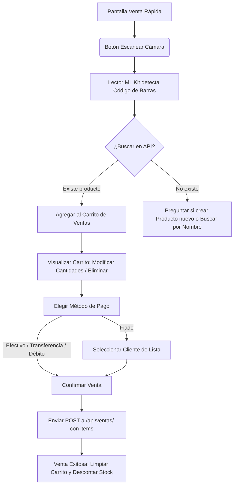
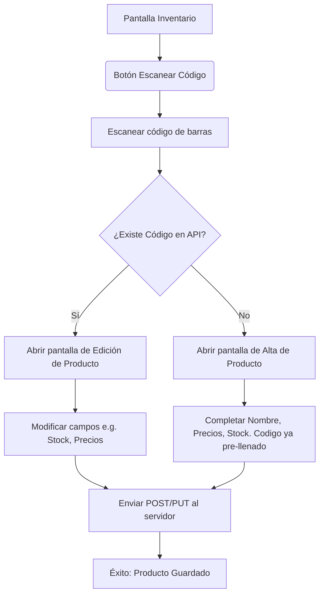

# Especificación Técnica y Brief de Desarrollo
## Aplicación Android de Escaneo de Códigos de Barras para Despensa LM

Este documento contiene toda la información técnica, modelos de datos, flujos de usuario y especificaciones de API requeridas para desarrollar una aplicación móvil Android que se integre con el sistema de gestión web **Despensa LM** (desarrollado en Django con base de datos SQLite).

---

## 1. Contexto del Proyecto

**Despensa LM** es un sistema web de control de inventario y ventas para un negocio minorista familiar. Cuenta con un catálogo público de productos, registro de ventas diarias, y gestión de cuentas corrientes ("fiados") para clientes frecuentes.

El objetivo de la aplicación Android es agilizar las operaciones diarias en el negocio facilitando dos flujos clave mediante el escaneo de códigos de barras usando la cámara del dispositivo móvil:
1. **Ventas rápidas**: Escanear códigos de barras de productos para agregarlos a un carrito y registrar la venta directamente (en efectivo, transferencia, débito o imputándolo como deuda/fiado al cliente).
2. **Carga/Edición de Inventario**: Escanear un código de barras para dar de alta un producto nuevo (completando el código automáticamente) o para editar los datos de un producto ya existente.

---

## 2. Base de Datos y Modelos Django (Estructura del Backend)

Los siguientes son los modelos relevantes definidos en el backend de Django en el archivo `despensa/models.py`. La aplicación de Android debe estructurar sus clases de datos e interactuar con la API basándose en esta estructura.

```python
class Producto(models.Model):
    codigo_barras = models.CharField('codigo de barras', max_length=64, unique=True, blank=True, null=True)
    nombre = models.CharField(max_length=160)
    precio_costo = models.DecimalField(max_digits=12, decimal_places=2, validators=[MinValueValidator(Decimal('0.00'))])
    precio_venta = models.DecimalField(max_digits=12, decimal_places=2, validators=[MinValueValidator(Decimal('0.00'))])
    stock_actual = models.IntegerField(default=0, validators=[MinValueValidator(0)])
    stock_minimo = models.IntegerField(default=5, validators=[MinValueValidator(0)])
    activo_en_catalogo = models.BooleanField(default=True)
    imagen = models.ImageField(upload_to='productos/', blank=True, null=True)
    creado = models.DateTimeField(auto_now_add=True)
    actualizado = models.DateTimeField(auto_now=True)

class Cliente(models.Model):
    nombre = models.CharField(max_length=160)
    telefono = models.CharField(max_length=40, blank=True)
    notas = models.TextField(blank=True)
    creado = models.DateTimeField(auto_now_add=True)

class CuentaCorriente(models.Model):
    class TipoMovimiento(models.TextChoices):
        DEUDA = 'DEUDA', 'Compra fiada'
        PAGO = 'PAGO', 'Entrega de dinero'

    cliente = models.ForeignKey(Cliente, on_delete=models.CASCADE, related_name='movimientos')
    fecha = models.DateTimeField(auto_now_add=True)
    tipo_movimiento = models.CharField(max_length=10, choices=TipoMovimiento.choices, default=TipoMovimiento.DEUDA)
    monto = models.DecimalField(max_digits=12, decimal_places=2, validators=[MinValueValidator(Decimal('0.01'))])
    descripcion = models.CharField(max_length=220, blank=True)

class VentaDiaria(models.Model):
    class MetodoPago(models.TextChoices):
        EFECTIVO = 'EFECTIVO', 'Efectivo'
        TRANSFERENCIA = 'TRANSFERENCIA', 'Transferencia'
        DEBITO = 'DEBITO', 'Debito'
        FIADO = 'FIADO', 'Fiado'

    fecha = models.DateField('fecha', default=timezone.localdate)
    monto_total = models.DecimalField(max_digits=12, decimal_places=2, validators=[MinValueValidator(Decimal('0.01'))])
    metodo_pago = models.CharField(max_length=20, choices=MetodoPago.choices)
    notas = models.CharField(max_length=220, blank=True)
```

---

## 3. Especificación de la API (REST Endpoints Requeridos)

Dado que la aplicación web Django utiliza vistas basadas en plantillas HTML estándar, se deben implementar o consumir los siguientes endpoints JSON para la aplicación móvil.

### 3.1. Autenticación y Seguridad

* **Método de Autenticación**: Autenticación por Sesión nativa de Django (`SessionMiddleware`).
* **CSRF Protection**: Django requiere un token CSRF para todas las solicitudes que modifican el estado (`POST`, `PUT`, `DELETE`).
  * Al realizar `POST` a `/api/login/`, la respuesta configurará las cookies `sessionid` y `csrftoken`.
  * La aplicación de Android debe extraer el token de la cookie `csrftoken` o del encabezado y enviarlo en las siguientes solicitudes de escritura en el encabezado HTTP: `X-CSRFToken: <valor_token>`.
  * Alternativamente, se puede habilitar autenticación por Token (como `TokenAuthentication` de Django REST Framework) o eximir a las APIs del chequeo de CSRF mediante el decorador `@csrf_exempt` si se implementa un mecanismo de firma seguro.

---

### 3.2. Endpoints de la API

#### A. Iniciar Sesión (Login)
* **Endpoint**: `POST /api/login/`
* **Request Body**:
  ```json
  {
    "username": "usuario_gestor",
    "password": "mi_password_segura"
  }
  ```
* **Response (200 OK)**:
  ```json
  {
    "success": true,
    "user": {
      "username": "usuario_gestor",
      "email": "correo@dominio.com"
    }
  }
  ```
* **Response (400 Bad Request / 401 Unauthorized)**:
  ```json
  {
    "success": false,
    "error": "Credenciales inválidas o incompletas."
  }
  ```

#### B. Buscar Producto por Código de Barras
* **Endpoint**: `GET /api/productos/buscar/?codigo_barras=7791234567890`
* **Response (200 OK)** - *Si el producto existe*:
  ```json
  {
    "id": 14,
    "codigo_barras": "7791234567890",
    "nombre": "Yerba Mate Rosamonte 1kg",
    "precio_costo": 3200.00,
    "precio_venta": 4000.00,
    "stock_actual": 10,
    "stock_minimo": 5,
    "activo_en_catalogo": true,
    "imagen_url": "https://midominio.com/media/productos/rosamonte.jpg"
  }
  ```
* **Response (404 Not Found)** - *Si no existe ningún producto con ese código*:
  ```json
  {
    "error": "Producto no encontrado con el código de barras provisto."
  }
  ```

#### C. Buscar/Listar Productos por Texto
* **Endpoint**: `GET /api/productos/?q=yerba`
* **Response (200 OK)**:
  ```json
  [
    {
      "id": 14,
      "codigo_barras": "7791234567890",
      "nombre": "Yerba Mate Rosamonte 1kg",
      "precio_venta": 4000.00,
      "stock_actual": 10
    },
    {
      "id": 25,
      "codigo_barras": "7799876543210",
      "nombre": "Yerba Mate Playadito 1kg",
      "precio_venta": 4200.00,
      "stock_actual": 8
    }
  ]
  ```

#### D. Crear Producto Nuevo
* **Endpoint**: `POST /api/productos/`
* **Request Body** (soporta opcionalmente `MultipartFormData` si se sube una imagen):
  ```json
  {
    "codigo_barras": "7791234567890",
    "nombre": "Yerba Mate Rosamonte 1kg",
    "precio_costo": 3200.00,
    "precio_venta": 4000.00,
    "stock_actual": 12,
    "stock_minimo": 5,
    "activo_en_catalogo": true
  }
  ```
* **Response (201 Created)**: Retorna el objeto del producto creado.

#### E. Editar Producto Existente
* **Endpoint**: `PUT /api/productos/<id>/` (o `POST /api/productos/<id>/editar/`)
* **Request Body**:
  ```json
  {
    "precio_costo": 3300.00,
    "precio_venta": 4150.00,
    "stock_actual": 15
  }
  ```
* **Response (200 OK)**: Retorna el objeto del producto actualizado.

#### F. Listar Clientes (Para venta Fiado)
* **Endpoint**: `GET /api/clientes/`
* **Response (200 OK)**:
  ```json
  [
    {
      "id": 3,
      "nombre": "Juan Pérez",
      "telefono": "1165432109",
      "saldo_actual": 1500.00
    },
    {
      "id": 5,
      "nombre": "María Gómez",
      "telefono": "1198765432",
      "saldo_actual": 0.00
    }
  ]
  ```

#### G. Registrar Venta Diaria
* **Endpoint**: `POST /api/ventas/`
* **Request Body**:
  ```json
  {
    "fecha": "2026-06-16",
    "monto_total": 8000.00,
    "metodo_pago": "FIADO",
    "notas": "Venta de yerba y azúcar",
    "cliente_id": 3,
    "items": [
      {
        "producto_id": 14,
        "cantidad": 2
      }
    ]
  }
  ```
  * *Nota sobre comportamiento del Backend*: Al procesar este POST, el backend debe:
    1. Registrar la `VentaDiaria` en la base de datos.
    2. Si `metodo_pago` es `FIADO`, crear un registro de `CuentaCorriente` asociado a `cliente_id` de tipo `DEUDA` por el `monto_total` (con descripción opcional automatizada basada en las notas o "Compra fiada").
    3. Descontar las unidades de `stock_actual` para cada producto provisto en `items` (atómico mediante transacciones de base de datos).
* **Response (201 Created)**:
  ```json
  {
    "success": true,
    "venta_id": 105,
    "monto_total": 8000.00,
    "nuevo_saldo_cliente": 9500.00
  }
  ```

---

## 4. Flujos de Trabajo en la Aplicación Android

### 4.1. Flujo: Registrar Venta


* **Comportamiento Clave**:
  * **Modo continuo**: Permitir escanear un código tras otro sin cerrar la cámara para agilizar la carga si el cliente lleva múltiples productos distintos.
  * **Cálculo de Subtotal y Total estimado**: Debe calcularse dinámicamente en la app de Android a medida que se agregan productos y se modifican las cantidades.

### 4.2. Flujo: Alta o Edición de Productos


---

## 5. Arquitectura y Tecnología Recomendada para la App de Android

Para garantizar una aplicación rápida, robusta y con alta precisión de escaneo, se recomienda seguir el siguiente stack y arquitectura:

1. **Lenguaje y UI**:
   - **Kotlin** como lenguaje principal.
   - **Jetpack Compose** para el desarrollo moderno de la interfaz de usuario.
   - Patrón de arquitectura **MVVM (Model-View-ViewModel)**.

2. **Escaneo de Código de Barras**:
   - **Google ML Kit Barcode Scanning API** en conjunto con **CameraX**. Es significativamente más rápido, preciso y requiere menos recursos que librerías antiguas como ZXing. Además, procesa los frames localmente en el dispositivo de forma instantánea.

3. **Redes y Comunicación**:
   - **Retrofit 2** con **Moshi** o **Kotlinx.serialization** para el parseo de JSON.
   - **OkHttpClient** configurado con un **CookieJar** (o administrador de cookies) para retener la sesión de Django (`sessionid`) de forma persistente. Esto evita tener que volver a iniciar sesión cada vez que se abre la app.
   - Manejo del header `X-CSRFToken` en peticiones mutables de forma automática a través de un interceptor de OkHttp.

4. **Persistencia y Modo Offline (Opcional pero Recomendado)**:
   - **Room Database** para almacenar un caché local de productos (permitiendo búsquedas súper rápidas de manera local) y para encolar ventas registradas cuando el dispositivo no tenga conexión a internet (sincronizándolas tan pronto retorne la conexión).

5. **Permisos Requeridos**:
   - `android.permission.CAMERA` para el funcionamiento del scanner.
   - `android.permission.INTERNET` para la sincronización con el servidor Django.
