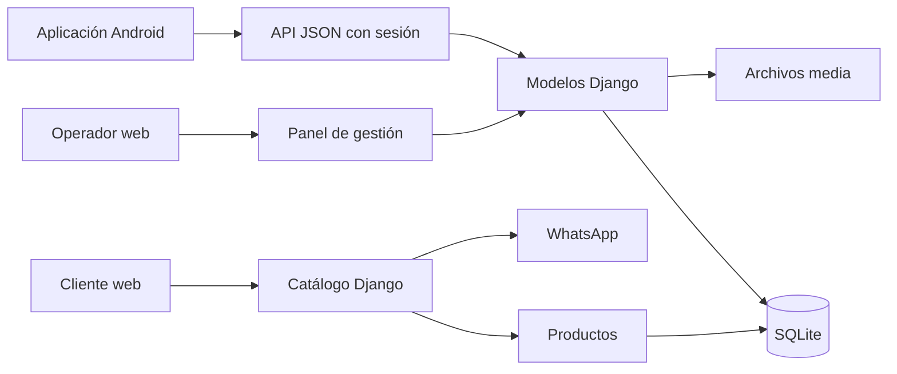

# Auditoría web y hoja de ruta

Fecha de revisión: 23 de julio de 2026

## Alcance

Esta auditoría cubre:

- catálogo público y pedido por WhatsApp;
- acceso y panel interno;
- productos, clientes, fiados y caja;
- API utilizada por la aplicación Android;
- configuración de Django y despliegue en PythonAnywhere;
- experiencia responsive, accesibilidad, seguridad, rendimiento y mantenibilidad.

La revisión fue de solo lectura. No se modificaron la web publicada, sus datos ni
su configuración.

## Resumen ejecutivo

Despensa LM ya tiene una base funcional y coherente para un negocio operado por
una sola persona. Django sigue siendo una buena elección: autenticación, panel
interno, catálogo, API y modelos comparten el mismo núcleo y no hay una razón
técnica que justifique reescribir el sistema desde cero.

La prioridad no debería ser cambiar de framework, sino proteger la integridad de
las ventas y simplificar los recorridos de uso. Después de confirmar que Android
es la herramienta operativa principal y que gran parte del catálogo aún está en
proceso de carga, los hallazgos principales son:

1. La venta recibida desde Android no es idempotente, confía en el total enviado
   por el teléfono, no conserva sus renglones y puede descontar stock sin validar
   existencias suficientes.
2. La publicación acepta HTTP sin redirigir a HTTPS y las cookies observadas no
   tienen el atributo `Secure`.
3. En móvil, el botón del carrito no realiza ninguna acción y el pedido queda
   después de una lista de 155 productos.
4. Los productos todavía no cargados deben permanecer ocultos del catálogo
   público hasta completar sus datos; no representan un problema de inventario.

## Decisiones recomendadas

### Mantener Django

Sí. Django encaja con el tamaño, el tipo de datos y el uso interno actual. Una
reescritura agregaría riesgo sin resolver por sí sola los problemas de stock,
sincronización, seguridad o calidad de datos.

### Mantener SQLite por ahora

Sí, mientras exista un único operador y se implemente un respaldo automático y
probado. PostgreSQL pasa a ser conveniente si aparecen varios operadores
simultáneos, integraciones que escriban en paralelo o crecimiento sostenido.

### Evolucionar de forma incremental

La web pública, el panel y Android deben conservar un único backend. El siguiente
paso es fortalecer el modelo de venta y el contrato de API, y luego mejorar la
interfaz sobre esa base.

## Arquitectura actual



Componentes principales:

- `Producto`: precios, stock, publicación, código de barras e imagen.
- `Cliente`: datos básicos y movimientos de cuenta corriente.
- `CuentaCorriente`: compras fiadas y pagos.
- `VentaDiaria`: fecha, total, método y notas.
- API Android: autenticación por sesión, productos, clientes, movimientos y
  creación de ventas.

La ausencia más importante del modelo es `VentaItem`: actualmente una venta no
conserva qué productos incluyó, cantidades ni precio unitario aplicado.

## Evidencia de producción

Mediciones realizadas sobre `https://despensalm.pythonanywhere.com/`:

| Indicador | Resultado |
|---|---:|
| Productos del catálogo | 155 |
| Productos publicados a `$0,00` | 131 |
| Imágenes de producto visibles | 0 |
| Altura aproximada de la página móvil | 57.264 px |
| Productos en gestión | 158 |
| Formularios en la lista de productos | 160 |
| Ancho de inventario móvil | 718 px sobre un viewport de 312 px |
| HTML inicial del catálogo | 85.827 bytes sin compresión |
| Logo | 199.888 bytes |
| Respuesta observada del catálogo | 1,46 a 2,88 s |

La respuesta de producción incluye protecciones como `X-Frame-Options: DENY` y
`X-Content-Type-Options: nosniff`, pero:

- `http://despensalm.pythonanywhere.com/` respondió `200` sin redirigir a HTTPS;
- la cookie CSRF observada no incluyó `Secure`;
- no se observó una política CSP.

## Hallazgos priorizados

| ID | Severidad | Área | Hallazgo | Impacto |
|---|---|---|---|---|
| V-01 | Alta | Ventas | No hay clave de idempotencia al sincronizar ventas offline. | Una respuesta perdida puede provocar una venta duplicada y doble descuento de stock. |
| V-02 | Alta | Ventas | La API usa el total enviado por Android y no lo recalcula con los artículos. | El total, el fiado y el inventario pueden divergir. |
| V-03 | Alta | Inventario | El stock se limita a cero en vez de rechazar una venta sin existencias. | Se ocultan faltantes y se pierde trazabilidad. |
| V-04 | Alta | Modelo | `VentaDiaria` no conserva artículos, cantidades ni precios unitarios. | No se puede auditar, corregir ni reconstruir una venta. |
| S-01 | Alta | Despliegue | HTTP no redirige a HTTPS y las cookies seguras no están habilitadas. | Una sesión puede exponerse si el acceso ocurre por HTTP. |
| UX-01 | Alta | Catálogo móvil | El botón `Carrito` no tiene manejador y el carrito queda al final de 155 productos. | El flujo principal de pedido parece roto en teléfono. |
| D-01 | Baja | Publicación | 131 productos todavía no cargados están visibles con precio cero. | No afecta el inventario interno, pero conviene ocultarlos hasta completar sus datos. |
| UX-02 | Baja | Gestión web móvil | La tabla de inventario desborda y oculta columnas y acciones. | Impacto limitado porque la operación móvil principal se realiza desde Android. |
| P-01 | Media | Rendimiento | Catálogo e inventario no tienen paginación ni carga progresiva. | El costo de render y navegación crece con cada producto. |
| S-02 | Media | API | Toda la API usa sesiones con vistas exentas de CSRF. | Contrato frágil para un cliente nativo y mayor superficie ante errores de autenticación. |
| S-03 | Media | API | Se devuelven textos de excepciones internas al cliente. | Filtración de detalles y respuestas inestables. |
| S-04 | Media | Catálogo | Los nombres se insertan en `innerHTML` al renderizar el carrito. | Un nombre malicioso o datos locales alterados podrían ejecutar HTML o JavaScript. |
| O-01 | Media | Operación | No hay procedimiento documentado de respaldo, restauración y rollback. | Un error de carga o despliegue puede causar pérdida de datos prolongada. |
| T-01 | Media | Pruebas | Hay 7 pruebas; no cubren ventas, concurrencia, idempotencia, JS ni responsive. | Regresiones críticas pueden llegar a producción. |
| D-02 | Baja | Rendimiento | El saldo se calcula con dos consultas por cliente. | Degradación gradual al crecer la cartera. |
| A-01 | Baja | Accesibilidad | Faltan etiquetas visibles en búsquedas, estados de foco y `aria-expanded` en el menú. | Menor usabilidad con teclado y tecnologías de asistencia. |
| M-01 | Baja | Dependencias | `requirements.txt` exige Django `<5.0`, pero el entorno local usa Django 5.2.6. | Desarrollo y producción pueden comportarse distinto. |

## Detalle funcional

### Catálogo público

Fortalezas:

- estructura simple y comprensible;
- buscador inmediato;
- carrito persistente en el navegador;
- pedido por WhatsApp sin obligar al cliente a crear una cuenta;
- tamaños táctiles razonables.

Mejoras:

- convertir el carrito móvil en un panel inferior accesible;
- mantener un botón fijo inferior con cantidad y total;
- no publicar productos sin precio, o mostrarlos como `Consultar precio` sin
  sumarlos al total;
- incorporar categorías y búsqueda normalizada por nombre, marca y código;
- paginar o cargar progresivamente;
- mostrar fotos reales optimizadas en WebP/AVIF;
- validar la cantidad contra el stock mostrado;
- reemplazar `innerHTML` por creación segura de nodos y manejar un
  `localStorage` inválido sin romper la página;
- ocultar datos de prueba del catálogo.

### Panel interno

Fortalezas:

- navegación reducida y apropiada para un único operador;
- acceso rápido a venta y fiado;
- formularios cortos;
- clientes y cuenta corriente ya tienen operaciones útiles;
- eliminación usa `POST` y token CSRF en la web.

Mejoras:

- reemplazar tablas anchas por filas adaptables o tarjetas compactas en móvil;
- agregar paginación, filtros por estado y ordenamiento;
- permitir edición rápida de precio, stock y visibilidad;
- usar archivado en vez de eliminación física de productos y clientes;
- agregar confirmación contextual que muestre qué se eliminará;
- unificar iconografía y retirar estilos inline;
- mostrar estados vacíos, de carga y de error de forma consistente;
- registrar quién y cuándo hizo una corrección, aunque hoy exista un solo usuario.

### Caja y ventas

La venta web actual solo guarda fecha, monto, método y notas. No selecciona
productos, no descuenta stock y una venta fiada no queda necesariamente vinculada
al cliente. Android sí envía productos, pero el servidor no conserva ese detalle.

El flujo recomendado es único para web y Android:

1. seleccionar o escanear productos;
2. definir cantidades;
3. seleccionar cliente solo cuando corresponda;
4. recalcular el total en el servidor;
5. validar stock dentro de una transacción;
6. guardar venta y renglones;
7. crear el movimiento de fiado en la misma transacción;
8. devolver el resultado de forma idempotente.

## Modelo objetivo mínimo

```text
Venta
- id
- client_operation_id (UUID único)
- fecha_operacion
- fecha_registro
- metodo_pago
- cliente (opcional)
- total_calculado
- notas
- estado

VentaItem
- venta
- producto
- nombre_snapshot
- cantidad
- precio_unitario
- subtotal
```

Reglas necesarias:

- `client_operation_id` debe ser único;
- repetir una solicitud con el mismo identificador devuelve la venta existente;
- cantidad y precio deben ser positivos;
- el servidor calcula subtotales y total;
- una venta sin stock suficiente se rechaza completa;
- stock, venta, artículos y fiado se actualizan en una sola transacción;
- la fecha original de una venta offline debe conservarse;
- una corrección se registra, no se borra silenciosamente.

## Seguridad recomendada

Prioridad inmediata:

- `DEBUG=False` y fallo de arranque si falta `DJANGO_SECRET_KEY`;
- `ALLOWED_HOSTS` exacto, sin `*` como valor predeterminado de producción;
- activar `Force HTTPS` en la pestaña Web de PythonAnywhere;
- `SESSION_COOKIE_SECURE=True`;
- `CSRF_COOKIE_SECURE=True`;
- considerar HSTS después de confirmar que todo el dominio funciona por HTTPS;
- limitar intentos de login;
- evitar devolver `str(exception)` en respuestas;
- logging estructurado sin contraseñas, cookies ni datos personales.

Para Android conviene migrar de la sesión web a un token revocable y dedicado.
Aunque el sistema tenga un solo usuario, separa correctamente navegador y app y
permite cerrar una sesión móvil sin afectar las demás. Los secretos de sesión en
Android deben almacenarse usando Android Keystore, no preferencias planas.

## Rendimiento y mantenibilidad

- agregar paginación al catálogo, productos, ventas y movimientos;
- anotar el saldo de clientes con agregaciones en una consulta;
- crear índices solo después de medir búsquedas reales;
- optimizar el logo y generar miniaturas de productos;
- extraer JavaScript y estilos inline a archivos versionados;
- definir una versión de Django única para local, CI y producción;
- versionar la API, por ejemplo `/api/v1/`;
- devolver errores JSON homogéneos, incluso para recursos inexistentes;
- documentar contratos de API y ejemplos de respuesta;
- agregar CI con pruebas y `manage.py check --deploy`.

## Hoja de ruta

### Bloque 0: proteger datos y acceso

Estimación orientativa: 3 a 5 días.

- crear y probar respaldo de `db.sqlite3` y `media`;
- corregir HTTPS, cookies y valores seguros de configuración;
- introducir `VentaItem` y clave de idempotencia;
- recalcular ventas y validar stock en el servidor;
- conservar fecha original de operaciones offline;
- agregar pruebas transaccionales y de reintento.

Criterio de aceptación:

- reenviar una venta no la duplica;
- una venta sin stock no modifica ningún dato;
- total, renglones, stock y fiado siempre coinciden;
- HTTP redirige a HTTPS y las cookies sensibles son `Secure`;
- existe una restauración de respaldo ensayada.

### Bloque 1: reparar los recorridos principales

Estimación orientativa: 3 a 5 días.

- carrito móvil fijo o panel inferior;
- inventario web responsive sin desbordamiento global, como mejora secundaria;
- paginación y filtros;
- política para productos sin precio;
- limpieza de datos de prueba;
- venta web con los mismos renglones que Android;
- archivado de productos y clientes.

Criterio de aceptación:

- un cliente completa un pedido desde móvil sin recorrer toda la página;
- el operador puede buscar, editar y archivar productos fácilmente desde Android;
- ningún producto público genera un total engañoso;
- web y Android producen la misma estructura de venta.

### Bloque 2: calidad operativa

Estimación orientativa: 1 semana.

- ampliar pruebas automáticas;
- pipeline de CI;
- logs y alertas de errores;
- guía de despliegue, rollback y restauración;
- contrato API versionado;
- auditoría básica de modificaciones.

Criterio de aceptación:

- cada despliegue ejecuta pruebas y chequeos;
- un error de sincronización puede diagnosticarse sin acceder a datos sensibles;
- una versión anterior puede restaurarse con pasos documentados.

### Bloque 3: evolución visual y comercial

Estimación orientativa: 1 a 2 semanas, según carga de contenido.

- sistema visual consistente para web pública y panel;
- fotografías optimizadas y categorías;
- estados de interacción, teclado y accesibilidad;
- filtros de caja por fecha y método;
- exportación CSV/PDF de ventas y cuentas;
- indicadores útiles: ventas del día, productos sin precio y stock crítico.

## Plan de pruebas mínimo

| Área | Casos imprescindibles |
|---|---|
| Venta | total recalculado, stock exacto, stock insuficiente, fiado, reintento idempotente |
| Sincronización | respuesta perdida, sesión vencida, venta offline antigua, reintentos múltiples |
| Productos | crear, editar, archivar, código duplicado, precio y stock inválidos |
| Clientes | alta, edición, pago, deuda, saldo agregado, archivado |
| Catálogo | solo publicados válidos, búsqueda, carrito, límite de stock, WhatsApp |
| Seguridad | acceso anónimo, métodos no permitidos, HTTPS, cookies, errores sin detalles internos |
| Responsive | 320, 390, 768 y 1440 px sin desbordes ni acciones ocultas |
| Accesibilidad | teclado, foco visible, nombres accesibles, contraste y estado del menú |

## Verificaciones realizadas

- recorrido visual en producción, escritorio y móvil;
- catálogo, login, dashboard, productos, clientes, cuenta corriente y nueva venta;
- revisión de modelos, vistas, formularios, plantillas, CSS y JavaScript;
- `python manage.py check`;
- `python manage.py check --deploy`;
- `python manage.py makemigrations --check --dry-run`;
- `python manage.py test`: 7 pruebas correctas;
- validación UTF-8 de archivos de texto;
- inspección de cabeceras HTTP y tamaños de respuesta.

`check --deploy` reportó cuatro advertencias: HSTS, redirección SSL, cookie de
sesión segura y cookie CSRF segura.

## Mapa de implementación

| Componente | Responsabilidad o cambio principal |
|---|---|
| [`config/settings.py`](../config/settings.py) | Valores seguros, HTTPS, cookies, logging y entorno |
| [`despensa/models.py`](../despensa/models.py) | `VentaItem`, idempotencia, archivado y consultas de saldo |
| [`despensa/views.py`](../despensa/views.py) | Validación transaccional, API homogénea, paginación y errores |
| [`despensa/urls.py`](../despensa/urls.py) | Versionado de API y nuevas operaciones |
| [`despensa/templates/despensa/catalogo.html`](../despensa/templates/despensa/catalogo.html) | Estructura del catálogo y carrito móvil |
| [`despensa/static/despensa/js/catalogo.js`](../despensa/static/despensa/js/catalogo.js) | Carrito, stock, almacenamiento seguro y WhatsApp |
| [`despensa/static/despensa/css/catalogo.css`](../despensa/static/despensa/css/catalogo.css) | Responsive público y panel inferior |
| [`despensa/static/despensa/css/gestion.css`](../despensa/static/despensa/css/gestion.css) | Inventario móvil, foco y estados |
| [`despensa/tests.py`](../despensa/tests.py) | Cobertura actual y base para separar pruebas por dominio |
| [`Repositories.kt`](../despensa-lm-android/app/src/main/java/com/example/data/repository/Repositories.kt) | Cola offline, reintentos e idempotencia Android |
| [`SessionCookieJar.kt`](../despensa-lm-android/app/src/main/java/com/example/data/remote/SessionCookieJar.kt) | Migración de sesión a credencial revocable y almacenamiento seguro |
| [`DESPLIEGUE_PYTHONANYWHERE.md`](../DESPLIEGUE_PYTHONANYWHERE.md) | Despliegue, respaldo, restauración y rollback |

## Orden recomendado

No conviene comenzar por un rediseño visual total. Primero debe asegurarse que una
venta sea correcta y no se duplique; después se reparan carrito e inventario
móvil; finalmente se aplica el sistema visual definitivo. Así cada mejora de
interfaz se construye sobre flujos y datos estables.
